layout: true
    
<div class="logo"></div> 

---

```{r setup, include=FALSE}
# Here you can place global options for the entire document.
# Mostly used for knitr settings, but can also load data etc.
# Whatever happens here will not show in the presentation.
knitr::opts_chunk$set(fig.retina = 3, 
                      warning = FALSE, 
                      message = FALSE,
                      echo = F)


library(tidyverse)


```


### Studying **usage** of *online political microtargeting* 

+ Ad Libraries

  + some improvement to before

  + inadequate (Edelson et al., 2020; Leerssen et al., 2019)
  
  + In the EU they at least provide targeting based on age, gender, location (thank you DSA)

+ Browser extensions

  + Rely on the "Why am I seeing this ad" label (López Ortega, 2022; Silva et al., 2020)
  
  + do not always correspond to the targeting criteria used by advertisers (Andreou et al., 2018)

+ Interviews

  + in-depth first-hand knowledge
  
  + campaigns might not be willing to share information on how they utilize voter data for targeted ads
  
  
-> current data mostly **I N A D E Q UA T E** for studying the phenomena

---

### Research on political microtargeting - a WEIRD problem?

+ Ad Libraries

+ Browser extensions

+ Interviews

---

### Studying **usage** of *online political microtargeting* 

+ Poor data access (Leerssen et al. 2021)

--

+ Risk of getting banned by platforms (NYU case 2021)
  
<center>
  
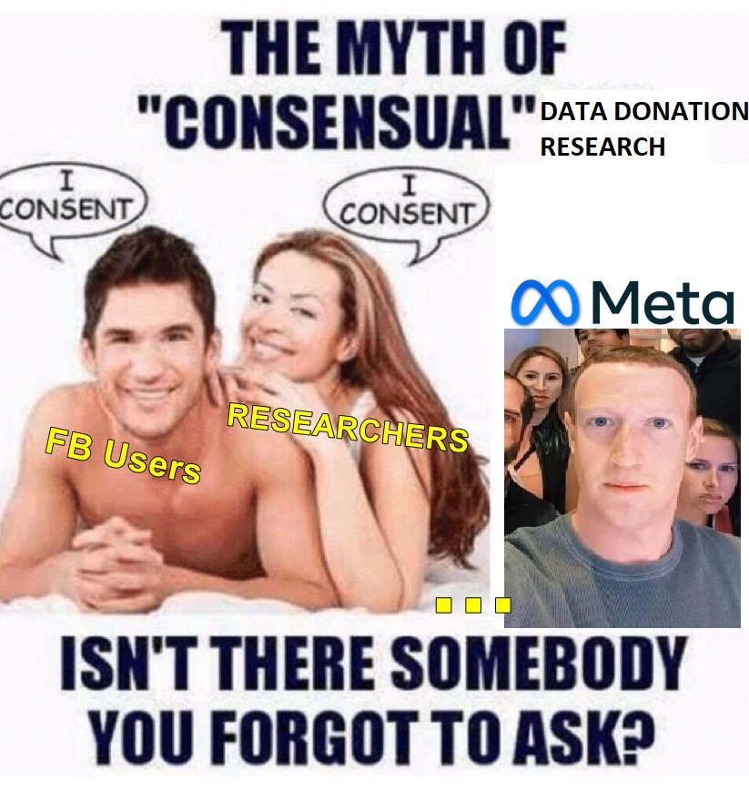

</center>

---

### Studying **usage** of *online political microtargeting* 

+ Poor data access (Leerssen et al. 2021)

+ Risk of getting banned by platforms (NYU case 2021)
  
**Meta Ad Targeting Dataset**

+ September 2022 Meta gave *vetted researchers* access to an "ad targeting dataset"

    + Includes **actual** targeting criteria of political ads on the **ad-level**
    
    + Coverage
    
        + All countries in which political ads run
        
        + August 3rd, 2020 - today (monthly updates)
        
        + Limited to using data on the Meta internal FORT platform
  
--
  
**Targeting of audiences by:**

+ Age, Gender, and Language

**Targeting and Exclusion (!) of audiences by:**

+ Location, "Detailed" Targeting ("Interests"), Custom and Lookalike audiences (and more)
        
---

class: middle, center

### For the first time we can investigate the usage of online political microtargeting at scale and worldwide using a very comprehensive (but probably not 100% complete) data source

---


class: middle, center

## Aims of this Research

**Descriptive Data Analysis of Political Microtargeting**

**Worldwide Context (not just US, UK and Europe)**

---

## Research Questions

+ RQ1: Assessing the Scale

  + **How prevalent** is the use of political microtargeting across the globe **and which targeting and exclusion strategies** do political campaigns employ?

<!-- How much money do political parties spend on targeted ads vs. ads that are targeted towards entire country?  -->

<!-- Split up by country, party type and family/ideology. -->

+ RQ2: Which countries?

  + How do different strategies of targeting and exclusion manifest across **countries**?

+ RQ3: Which parties?

  + How do different strategies of targeting and exclusion manifest across **parties**?

<!-- 1.	who are the most targeted audiences -->
<!-- 2.	who are the most excluded audiences -->
<!-- 3.	how this differs by country/party type and family/ideology -->


---

## Four Targeting and Exclusion Strategies

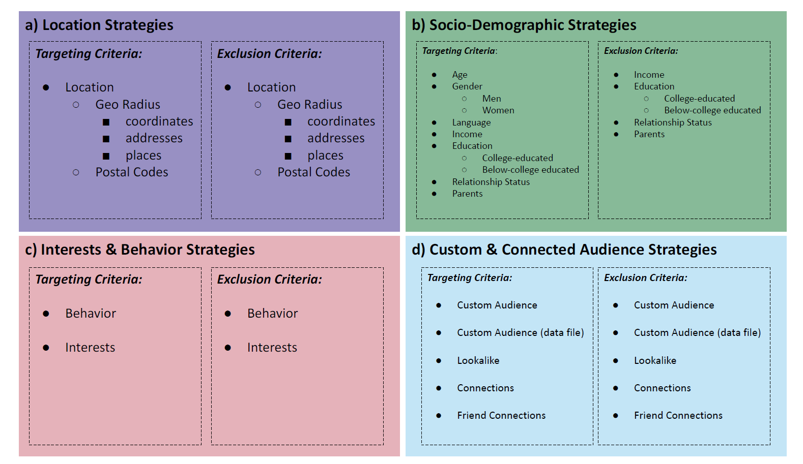

---

## Method

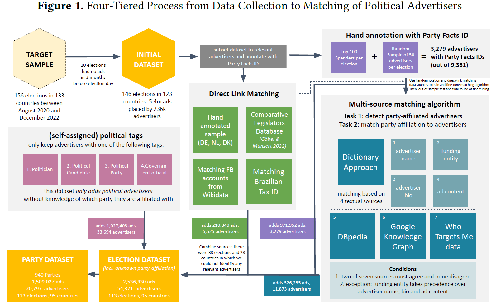

---

class: white

## Sample Description

.leftcol30[

+ All **national** elections between *August 2020 and December 2022*

+ Time-frame: 3 months before election day


+ We identified: 
  + *132 countries* 
  + *156 elections*
]

<!-- **122 *national* elections** in **101 countries** between -->

.rightcol70[
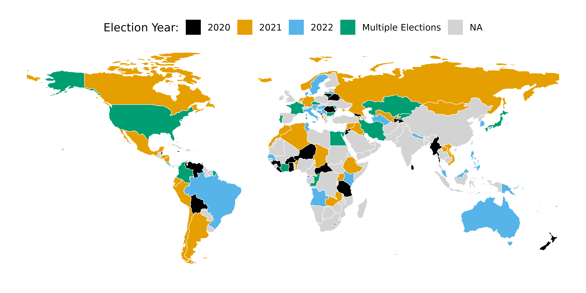

]

---

class: white

## Sample Description

.leftcol30[

+ All **national** elections between *August 2020 and December 2022*

+ Time-frame: 3 months before election day


+ Final target sample: 
  + **95 countries** 
  + **113 elections** 
  + 10 countries had no data (e.g. Russia, Iran)
  + 27 countries no political advertisers (e.g. Venezuela, Niger)

+ Only focus on **political parties and candidates**
]

<!-- **122 *national* elections** in **101 countries** between -->

.rightcol70[
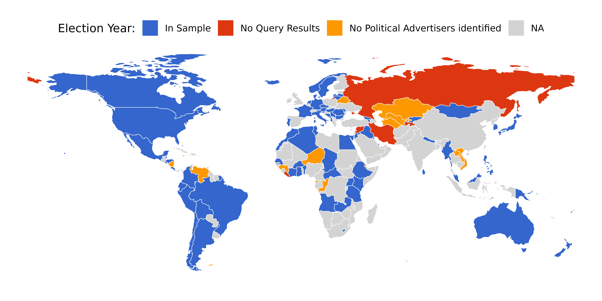

]

---

class: white

## Majority of Ad Spend is in the US


<br>

+ Median spent per country: 40k-207k US Dollar

+ Total spent: 418m-643m US Dollar

---

class: white

## Sample TODAY

.leftcol30[


First results based on: 
  
+ **27 countries** 

+ **30 elections** 

+ **309** hand-coded **political parties**
  + looking at 100 top advertisers in each country which on average covers 91.36% of ad spend

+ placing **871k ads** 

+ combined (minimum) ad spend: **$241 Million**

(data annotated & enhanced using the the *Partyfacts database*, see Döring & Regel 2019)

]


.rightcol70[


]


---

class: white

#### RQ1: Global Prevalence and Usage

.leftcol40[

> *Targeting more common than excluding*


+ *Targeting:* Median **80.14%** of budgets are spent on ads with **at least one targeting criterion**

+ *Excluding:* Median **8.7%** of budgets are spent on ads with **at least one exclusion criterion**
]

.rightcol60[


<center>


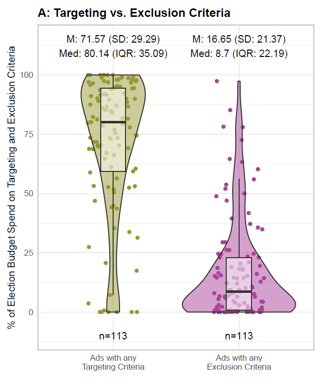

</center>
]

---


class: white

#### RQ1: Global Prevalence and Usage

> *Most commonly **one** targeting and exclusion criterion used*


.leftcol[

+ *One Criterion:* Median **38.12%** of budget


]

.rightcol[


+ *Two Criterias:* Median **22.46%** of budget


]


<center>


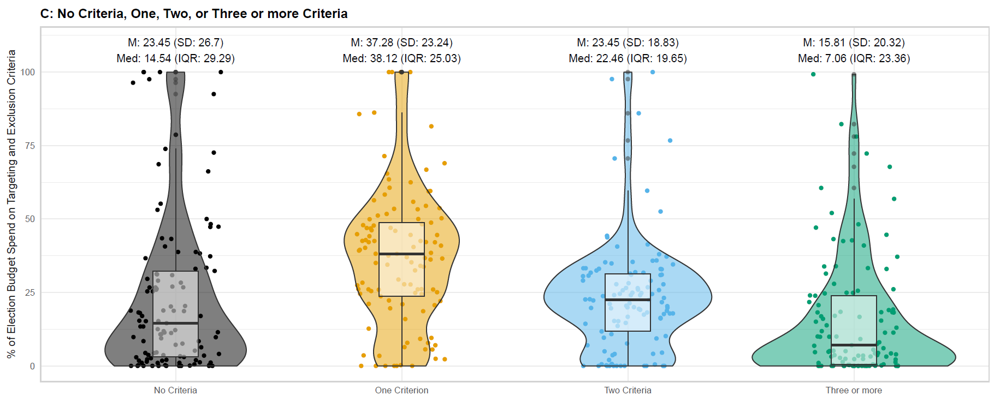

</center>


---

class: white

#### RQ1: Global Prevalence and Usage

> *Targeting common across geographical regions*


---


class: white

#### RQ1: Global Prevalence and Usage

.leftcol30[

> *Location most prevalent*  


+ *Location:* Median **46.92%** 

+ *Socio-Demographics:* Median **32.22%** 

+ *Interests & Behavior:* Median **15.20%** 

+ *Custom & Connected Audiences:* Median **16.48%** 

]

.rightcol70[

<center>


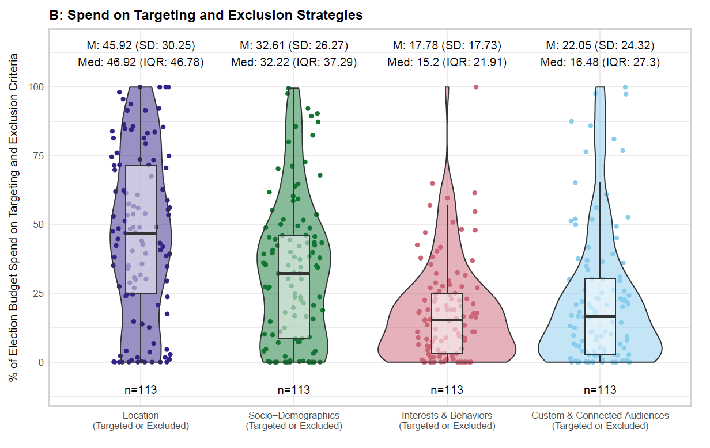

</center>

]


---

class: white

#### RQ2: Country Differences


+ **Political factors**

+ **Regulatory factors**

+ **Resource and Reach factors**

---

class: white

#### Political factors
  
  > Targeting strategies are common regardless of level of democracy


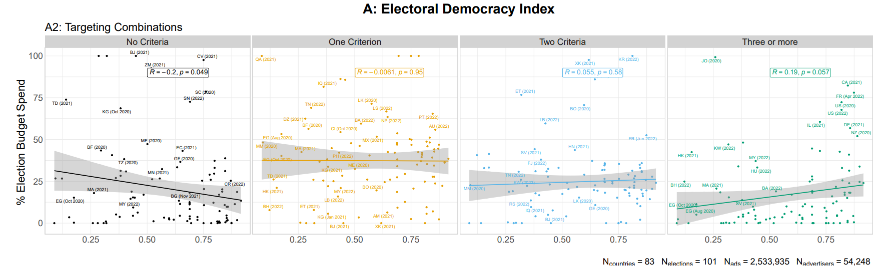
  
---


class: white

#### Political factors

  > Targeting strategies are common regardless of level of democracy
  
  
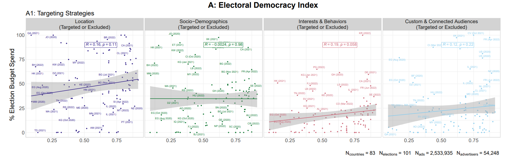
  
---

class: white

#### Political factors 

>  Proportional systems seem more likely to use microtargeting strategies than majority systems

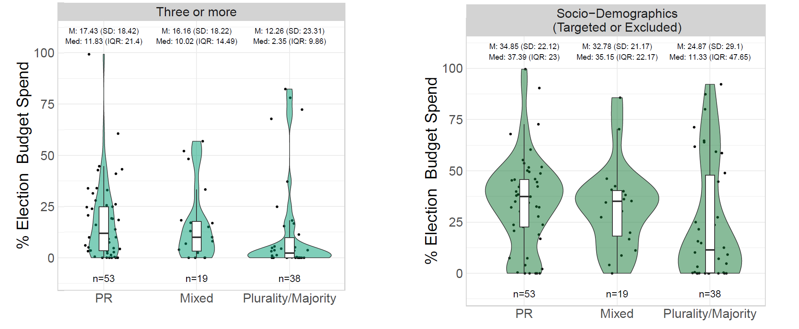
  
---


class: white

#### Regulatory factors 

  > Restrictions on traditional media spending seem to encourage spending on (micro-)targeting
  
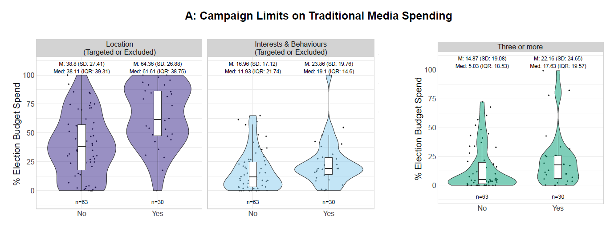

---


class: white

#### Regulatory factors 

> Countries with stricter data protection laws exhibit more spending on microtargeting
  


---


class: white

#### Resource and Reach factors

> GDP per capita correlates more positively with spending on microtargeting

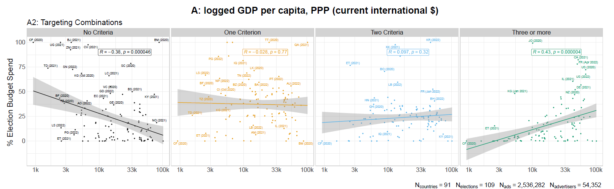


---

class: white

#### Resource and Reach factors

> GDP per capita correlates more positively with spending on (micro-)targeting


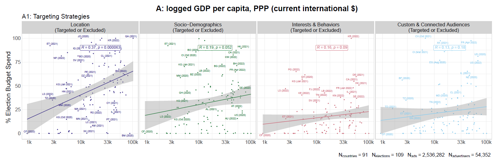


---

class: white

#### Resource and Reach factors

> The more users on the platform as a share of population there is more spending on (micro-)targeting

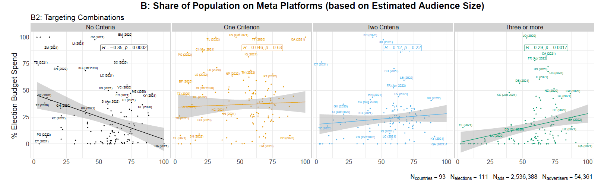


---

class: white


#### Resource and Reach factors

> The more users on the platform as a share of population there is more spending on (micro-)targeting

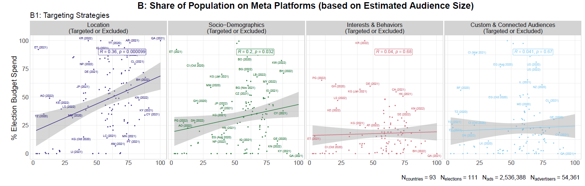


---


#### RQ2: Country Differences

+ **Political factors**

  + Targeting strategies are common regardless of level of democracy

  + Proportional systems seem more likely to use microtargeting strategies than majority systems

+ **Regulatory factors**

  + Restrictions on traditional media spending seem to encourage spending on (micro-)targeting
  
  + The stricter data protection laws the more spending on microtargeting


+ **Resource and Reach factors**

  + GDP per capita correlates more positively with spending on (micro-)targeting

  + The more users on the platform as a share of population there is more spending on (micro-)targeting

---

class: white


#### Which parties use microtargeting?

> No ideological difference between microtargeting focus

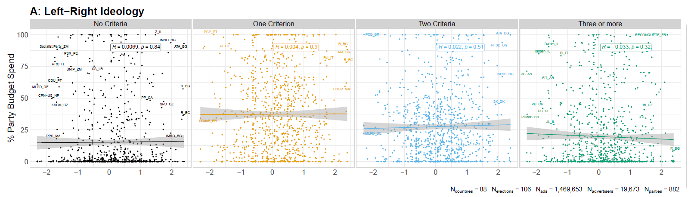
---

class: white


#### Which parties use microtargeting?

> No ideological difference between microtargeting focus

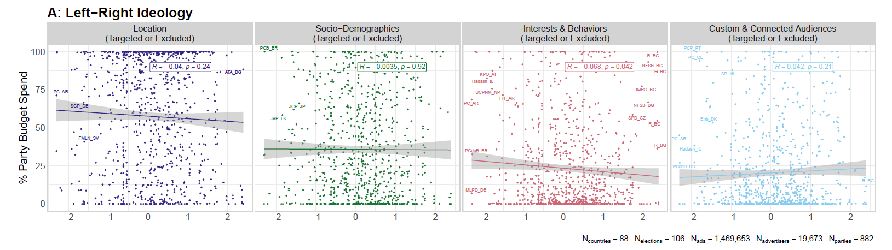


---

class: white

#### Which parties use microtargeting?

> Older parties seem more likely use microtargeting strategies

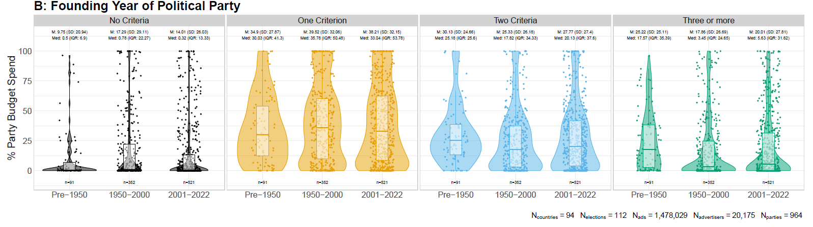


---


class: white

#### Which parties use microtargeting?

> Older parties seem more likely use microtargeting strategies

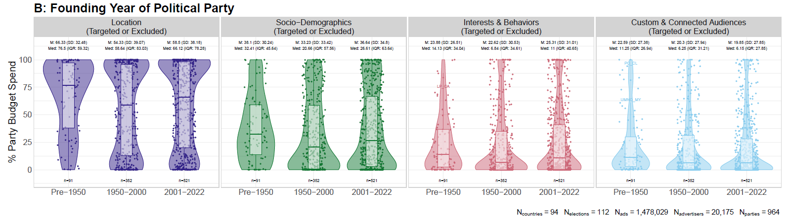


---

class: white

#### How do they use microtargeting? - Right-leaning parties


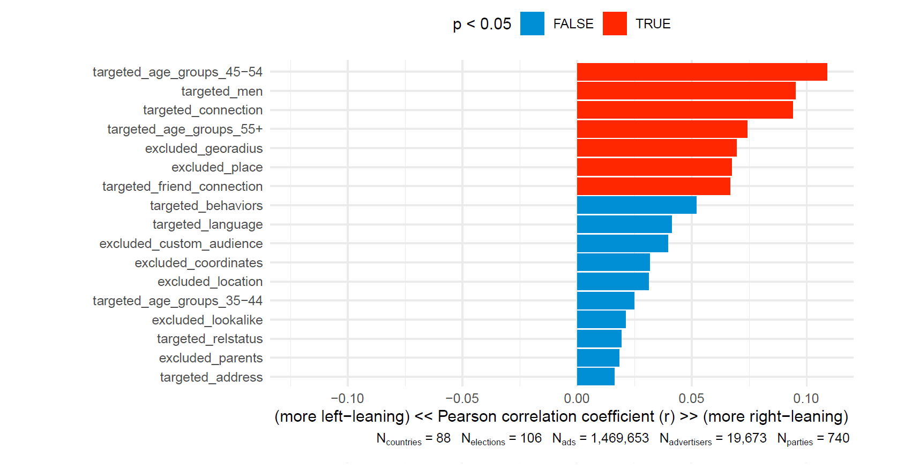

---

class: white

#### How do they use microtargeting? - Right-leaning parties


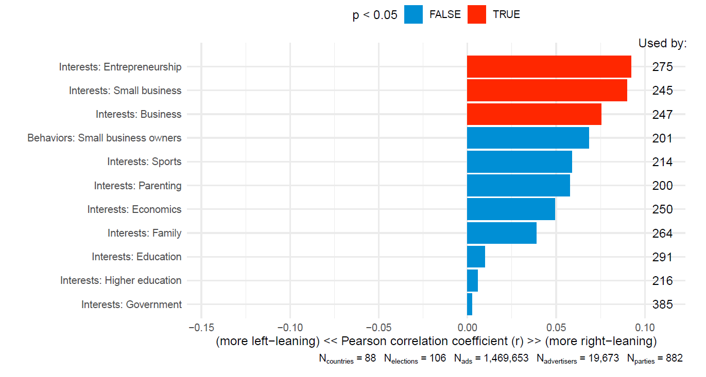


---


class: white

#### How do they use microtargeting? - Left-leaning parties


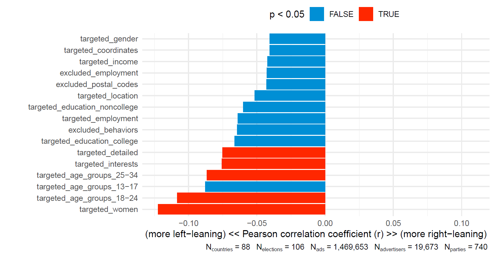

---

class: white

#### How do they use microtargeting? - Left-leaning parties


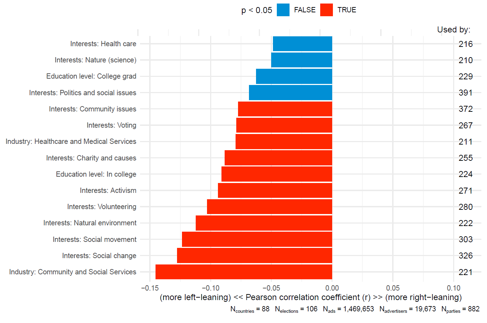


---

class: white

#### "Interest in politics" most commonly targeted

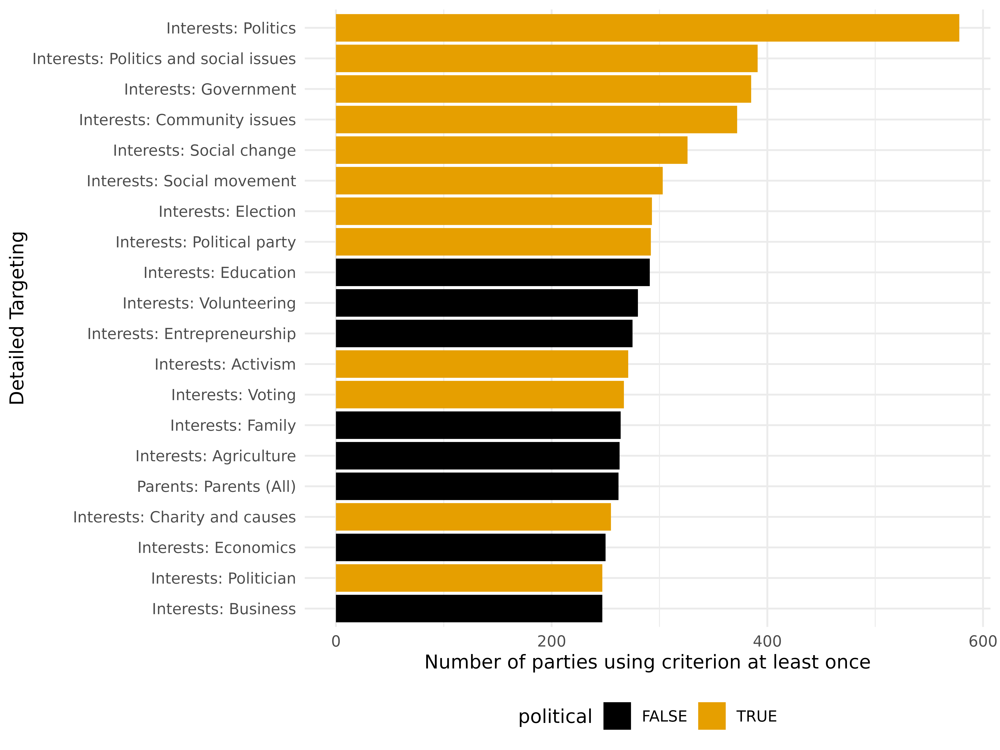


---


#### RQ3: Party Differences


+ **Which parties use microtargeting?**

  + No ideological difference between microtargeting focus

  + Older parties seem more likely use microtargeting strategies

+ **How do they use microtargeting?**

  + Parties seem to use microtargeting primarily to reach core audiences

  + Parties seem to ue microtargeting primarily to reach politically involved audiences


---

class: white

### European Parliament takes Stance on Political Advertising Regulation

.pull-left[

+ Draft legislation on the transparency and targeting of political advertising

+ Article 12, §1c:

> Targeting and ad delivery techniques referred to in this paragraph shall **not combine more than four categories of personal data**, including the location of the data subject.

So how much ad spend in EU elections would fall under this proposal?

#### 36.90% or 5.3 million Euros

]

.pull-right[


]


---

class: white 

#### RQ2: Who are political parties including and excluding on Meta? (party-level)

.pull-left[

]

--

.pull-right[

]

---

class: white

#### RQ2: Who are political parties including and excluding on Meta? (party-level)


---


## Conclusions

+ Online political **targeting** is **common around the world**

**However:**

  + Most commonly using a single targeting criterion
    
  + Most commonly using location and socio-demographics (e.g. age)

--

**So is political microtargeting overhyped?**

--

+ Its usage in less-democratic countries or less stable societies should make us pause 


+ political microtargeting is used **by both left and right**

  + they **target** their respective **core audiences**
  
      + i.e. concerns about a **defragmented public sphere*** not unfounded
      
  + they often target people already **interested in politics**
  
      + i.e. concerns about **"political redlining"**    not unfounded
      
---

## Conclusions

+ The **Ad Targeting Dataset** released by Meta is a **step in the right direction** for ad transparency

  + **however**, increases **dependency on Meta, should be seen critical**, especially given  announcement of recent Twitter API changes

  + dataset is **not easily accessible** for researchers, and not at all by civil society
  

---

class: middle, center

# Thank you for listening


<div style="text-align: center;">
    <div style="display: inline-block; text-align: left;">
<p align="left">`r icons::icon_style(icons::fontawesome("link"),fill="lightgrey")`&nbsp;favstats.github.io/targex (Slides) <br> `r icons::icon_style(icons::fontawesome("twitter"),fill="blue")`&nbsp;@favstats <br> `r icons::icon_style(icons::fontawesome("mastodon"),fill="#615ff7")`&nbsp;@favstats@fosstodon.org</p>
    </div>
</div>


---

class: middle, center

## APPENDIX


---

#### RQ1 How big is the phenomena of Political Microtargeting?

    
### First Issue: Meta Ad Targeting Dataset is Messy

*How do we identify political actors advertising on Meta?*

1. Hand-labeled data: Netherlands, Denmark, and Germany

2. Self-identified labels as "political" party/candidate etc.

    - scrape this from the Facebook Ad Library (have done this for 180k+ advertisers)
    


---

### Netherlands


---

### Germany


---

### Denmark


---


### Second Issue: Which party do advertisers belong to?

1. Matching using party names and abbreviations -> can be messy!
    + this may include also searching for content of ads

2. (Automated) Wikipedia search (especially for candidates)

3. Let ChatGPT do it? ;')


---

## Validation of Automated Matching

1. Make sure we are not missing any influential spenders
    + Retrieve 50 Top Spenders for each election
    + Retrieve 50 Top Spenders who were automatically not matched
    + hand-label them

2. From the rest, draw a random sample of 100 matched and non-matched advertisers
    + hand-label them
    + make sure we also have smaller advertisers cause they count as well
    
20 Elections X 200 Hand-labelling = 4000 coding task
    
    
---

## Questions

Does anyone have ideas about how to

1. maximize coverage (more countries)
2. keep data quality high (other validation methods)

One other idea: classify with machine learning model that is out there? I know Google can identify names and logos from images.. but can it also identify political party from names?

---

## Conclusion

End the paper with a research agenda: what should we research in the future? 


**Thanks for listening!**


---

class: middle, center

## Some Rest


---

<br>

+ February 2021 Meta gives *vetted researchers* access to an "ad targeting dataset"

    + **Actual** targeting criteria used in Social Issue, Electoral, and Political (SIEP) ads on the **ad-level**
    
    + through the FORT platform (**F**acebook **O**pen **R**esearch and **T**ransparency) 
    
    + Timeframe: August 3rd - November 1st , 2020
    
    + Coverage: Only the United States
    
    + Difficult to get access
    
---


### Data on Ad Targeting


+ September 2022: Meta adds "Audience" tab to public Meta Ad Library  

    + Coverage: All countries in which political ads run
    
    + Targeting criteria: Age, Gender, Location, Language, "Interests" and "Behaviour", Custom and Lookalike Audiences 
    
    + Downside: only available for last 7, 30, and 90 days windows
    
    + No possibility to download data (however: I've written an R package to be released to access data)
        


---

### Previous studies suggest advertisers on Meta primarily target own supporters

**Fowler et al. 2021** conclude in their comprehensive study on Meta ad targeting in the 2018 US midterm election


> "all point[s] toward the use of social media ads for **mobilization of existing supporters** as opposed to persuasion of marginal voters"

<!-- based on three factors: -->

<!-- + reduced negativity -->
<!-- + lower issue content -->
<!-- + increased partisanship -->

<!-- compared to TV ads -->

**Ridout et al. 2021:**

> More than 50% of ads are **acquisition, fundraising, and mobilization** ads in selected Senate races on Meta.

**Stuckelberger and Koedam 2022:**

> Our analysis across five countries [...] suggests that **coalition maintenance** is the dominant party strategy for demographic groups.

---

class: white

### Evidence that parties target supporters (WTM data)


---

class: middle, center

## Theories for who gets targeted & 
## who gets excluded


---

### Theories for who gets targeted & who gets excluded


#### Coalition Maintenance vs. Expansion strategies 

*Based on Rohrschneider 2002; Panagopoulos and Wielhouwer 2008; Stuckelberger and Koedam 2022*

<br>

+ **Coalition maintenance strategy** (*"mobilizing"*)

    + Reach out to people who are past and present supporters to strengthen coalition 

+  **Coalition expansion strategy** (*"chasing"*)

    + Target people who are potential voters or yet undecided to expand coalition 


---

### Theories for who gets targeted & who gets excluded


#### **Consideration sets** 

*(Based on Oscarsson and Rosema 2019)*

+ Originally a marketing theory on consumer behaviour: 
    + set of products that consumer would be willing to buy based on certain criteria 
        + for example, price, brand, etc.


+ In electoral context: 
    + set of political parties citizen would vote for based on certain criteria 
        + e.g. ideological alignment, chances to govern, be in parliament, etc.
    
<br>
    
+ **In targeting context (from perspective of campaigns):**
    + set of audiences that a party chooses to advertise to 
        + e.g. based on **issue ownership**, past vote, ideological alignment, etc.
    + implies: audiences outside of consideration sets should be excluded
    

---

class: white

### A theory for who gets targeted & who gets excluded


---

class: white

### A theory for who gets targeted & who gets excluded


---

class: white

### A theory for who gets targeted & who gets excluded


---

class: white

### A theory for who gets targeted & who gets excluded


---


class: white

### A theory for who gets targeted & who gets excluded

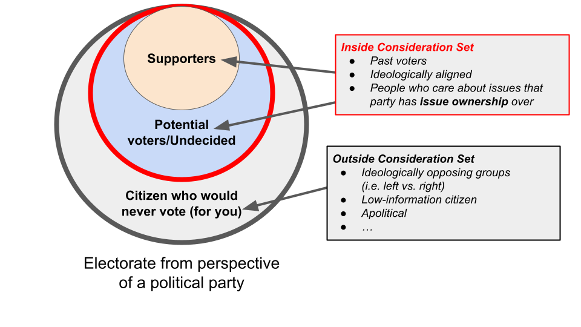


---

## Hypotheses

> Parties target audiences within consideration set

> Parties exclude audiences outside their consideration set

Maybe:

> Smaller parties are more likely to engage in coalition expansion rather than coalition maintenance in an effort to gain votes from bigger competitors

---


## Requirements

1. Decide which elections should be studied

    + Suggestion: Netherlands 2021, Germany 2021, Canada 2021, Italy 2022, Sweden 2022, Denmark 2023 (?)
    + other elections: Lithuania 2020, Portugal 2020, Liechtenstein 2021, Bulgaria 2021, Cyprus 2021, Norway 2021, Iceland 2021, Czech Republic 2021, Hungary 2022, Slovenia 2022
    
2. Coding of targeting criteria into 
    
    +  **in consideration set**
        + Supporters                 
        + Potential voters       
        
    +  **outside of consideration set**
        + People who are not likely to vote for party
    
> requires some expertise in studied countries

Question: what about targeting criteria that do not fit in any of these categories?

---

## Who targets who and why but.. also how?

+ So this research design does not incorporate at all **which messages** parties use to target people.

+ Is this a major flaw? Reasonable compromise?

### More questions

Does the theory idea make sense?

Any other suggestions?

Problem with the theory: what about political parties that want to **demobilize supporters of the opposing party**? That's not accounted for. However: is this even an issue outside of the US?


